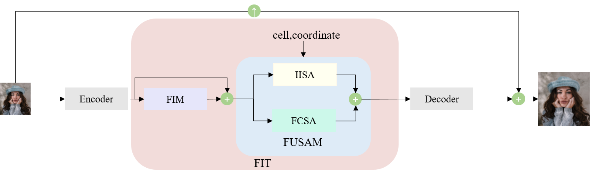

<div align="center">

# Frequency-Integrated Transformer for Single Image Arbitrary-Scale Super-Resolution

**FIT: Incorporating and Utilizing Frequency Information for Arbitrary-Scale Image Super-Resolution**

[!\[Task](https://img.shields.io/badge/Task-Arbitrary--Scale%20SR-blue)](#)
[!\[Backbone](https://img.shields.io/badge/Backbone-EDSR%20%7C%20RDN-green)](#)
[!\[Metrics](https://img.shields.io/badge/Metrics-PSNR%20%7C%20SSIM-orange)](#)
[!\[Code](https://img.shields.io/badge/Code-Coming%20Soon-lightgrey)](#code-release)

</div>

## Overview

Frequency-Integrated Transformer (FIT) is a plug-in frequency-aware enhancement block for **single image arbitrary-scale super-resolution (ASSR)**. Existing implicit neural representation based ASSR methods mainly rely on spatial-domain features, while the frequency domain provides complementary cues for structural details, texture fidelity, and global context modeling. FIT introduces frequency information into the ASSR pipeline in a component-retentive manner and further utilizes spatial-frequency interactions during implicit reconstruction.

<p align="center">
  
</p>

FIT is placed between an image encoder and an implicit decoder. Given a low-resolution input, the encoder first extracts spatial features. FIT then enhances the feature representation through frequency incorporation and frequency-aware self-attention. The decoder finally predicts RGB values at arbitrary high-resolution coordinates.

## Quantitative Results

### DIV2K validation set

The following table reports representative PSNR/SSIM results on the DIV2K validation set. FIT achieves consistent gains across both in-scale and out-scale magnifications.

|Encoder|Method|x2|x3|x4|x6|x12|x30|
|-|-:|-:|-:|-:|-:|-:|-:|
|EDSR|HIIF|34.90 / 0.947|31.26 / 0.920|29.28 / 0.864|27.01 / 0.793|23.91 / 0.640|20.56 / 0.479|
|EDSR|**FIT**|**35.01 / 0.949**|**31.35 / 0.923**|**29.36 / 0.868**|**27.08 / 0.797**|**23.97 / 0.644**|**20.62 / 0.482**|
|RDN|HIIF|35.24 / 0.953|31.55 / 0.929|29.53 / 0.875|27.17 / 0.802|24.07 / 0.650|20.65 / 0.484|
|RDN|**FIT**|**35.34 / 0.955**|**31.62 / 0.931**|**29.60 / 0.878**|**27.25 / 0.806**|**24.14 / 0.654**|**20.73 / 0.488**|

### Benchmark datasets with RDN encoder

|Dataset|x2|x3|x4|x6|x8|
|-|-:|-:|-:|-:|-:|
|Set5|**38.42 / 0.962**|**34.87 / 0.941**|**32.73 / 0.896**|**29.54 / 0.820**|27.36 / 0.742|
|Set14|**34.44 / 0.930**|**30.88 / 0.845**|**29.09 / 0.804**|**26.91 / 0.724**|**25.47 / 0.666**|
|BSD100|**32.49 / 0.892**|**29.45 / 0.816**|**27.91 / 0.764**|**26.14 / 0.703**|**25.07 / 0.658**|
|Urban100|**33.42 / 0.912**|**29.26 / 0.824**|**27.21 / 0.751**|**24.67 / 0.644**|**23.23 / 0.595**|

## Qualitative Results

### Integer-scale super-resolution

<p align="center">
  
</p>

FIT reconstructs clearer local textures and sharper structural boundaries, especially in challenging regions such as flowers, letters, license plates, and building windows.

### Non-integer-scale super-resolution

<p align="center">
  
</p>

FIT remains stable under non-integer scale factors, such as x1.8, x2.5, x3.3, and x4.2, showing practical scale-adaptive reconstruction ability.

## Interpretability Analysis

The paper further analyzes FIT using a multi-faceted diagnostic framework from the feature, frequency, and context perspectives.

### Visual feature maps

<p align="center">
  
</p>

FIM produces clearer feature responses than purely spatial or alternative frequency modules, indicating improved detail characterization.

### Frequency error maps

<p align="center">
  
</p>

<p align="center">
  
</p>

These visualizations show that real-imaginary mapping and cross-domain subspace interaction help reduce frequency-level reconstruction errors.

### Local attribution maps

<p align="center">
  
</p>

FCSA expands the effective context region, supporting the claim that frequency-domain correlation helps capture global contextual information.

## Datasets and Evaluation

* **Training set:** DF2K
* **Evaluation sets:** DIV2K validation set, Set5, Set14, BSD100, and Urban100
* **Metrics:** PSNR and SSIM
* **Degradation protocol:** Bicubic downsampling
* **Backbones:** EDSR and RDN
* **Scales:** Integer and non-integer arbitrary scales, including x2 to x30 on DIV2K

## Code Release

This repository is currently prepared as the project page for FIT. Training code, testing code, pretrained models, and detailed reproduction instructions will be updated after the paper is accepted.

## TODO

* \[ ] Release training and inference code
* \[ ] Release pretrained models
* \[ ] Add dataset preparation scripts
* \[ ] Add full benchmark logs
* \[ ] Add model checkpoints and configuration files

## Citation

If this work is useful for your research, please cite:

```bibtex
@article{wang2026fit,
  title   = {Frequency Integrated Transformer for Single Image Arbitrary Scale Super Resolution},
  author  = {Wang, Xufei and Ge, Fei and Zhang, Qicheng and Zhu, Jinchen and Hou, Zhimeng and Weng, Shizhuang and Zheng, Ling},
  journal = {Under Review},
  year    = {2026}
}
```

The source code will be made publicly available upon acceptance.

